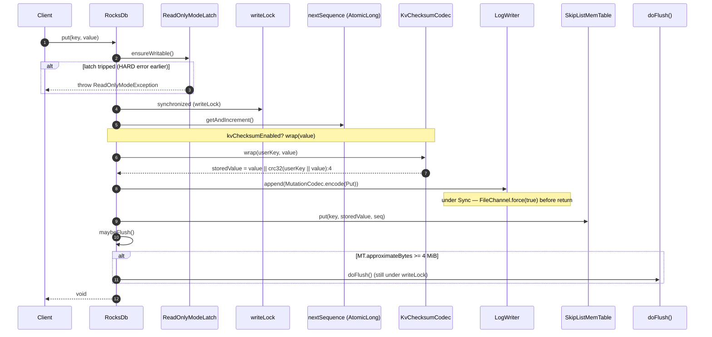

# 03 — Write path

Plan §6.1. Every write call (`put`, `delete`, `deleteRange`) follows the same six-step skeleton: validate, lock, allocate sequence, append to WAL, insert into MemTable, maybe flush.

## API surface

| Method | Engine | Returns |
|---|---|---|
| `RocksDb.put(Key, Slice)` | single-CF | `void` |
| `RocksDb.delete(Key)` | single-CF | `void` |
| `RocksDb.deleteRange(Key, Key)` | single-CF | `void` |
| `RocksDb.putWithUserTs(Key, UserTimestamp, Slice)` | single-CF (UDT mode only) | `void` |
| `ColumnFamilyDb.put(ColumnFamilyHandle, Key, Slice)` | multi-CF | `void` |
| `ColumnFamilyDb.delete(ColumnFamilyHandle, Key)` | multi-CF | `void` |

> **Implementation status:** ADR-0004 / ADR-0006 describe `WriteOptions` (per-write durability mode, sync override) and `WriteBatch` (multi-op atomic group). The current API takes individual mutations with no `WriteOptions` parameter; WAL durability is fixed at engine open via the `LogWriter` constructor. There is no `WriteBatch` type today — each `put`/`delete`/`deleteRange` is its own WAL record and gets its own fsync (under Sync mode).

## Write skeleton



The same skeleton applies to `delete` (no value bytes, op type `0x00`) and `deleteRange` (start and end keys, op type `0x04`, additional bounds validation that `startKey < endKey` strictly).

## Step-by-step

### 1. `ensureWritable()`

The very first action of every write call. `ReadOnlyModeLatch.ensureWritable()` is a lock-free `volatile` read; if the latch has been tripped by a prior HARD-severity event (KV checksum mismatch, block CRC mismatch, classified IO error), the call throws `ReadOnlyModeException` immediately and the write does **not** consume a sequence number, touch the WAL, or modify the MemTable.

Reads remain unaffected — see [`08-error-handling.md`](08-error-handling.md).

### 2. `synchronized (writeLock)`

A single `Object writeLock` per `RocksDb` instance. Every mutation serialises through it; reads do not take the lock (they read `volatile` references to the active and frozen MemTables, then walk the immutable `Version`). This means write throughput is single-threaded but reads scale freely.

### 3. Sequence allocation

`nextSequence` is an `AtomicLong` initialised at open to `recoveredMaxSeq + 1`. Each mutation calls `getAndIncrement()` while holding the write lock — the lock is technically redundant for atomicity here (the atomic is its own lock), but it guarantees sequence-monotonic ordering with the WAL append that follows.

### 4. KV checksum wrap (optional)

If `kvChecksumEnabled = true`, the value bytes are wrapped before they enter the WAL:

```
storedValue = value || CRC32(userKey || value)[4 LE]
```

The wrapped bytes flow opaque through WAL → MemTable → SSTable → block cache → compaction → read path; **compaction never re-derives the checksum**. On read, `KvChecksumCodec.unwrap` verifies and strips the trailer; a mismatch throws `KvChecksumMismatchException` which the severity classifier maps to `HARD_ERROR_READ_ONLY` and trips the latch. See [`07-integrity.md`](07-integrity.md).

The 4-byte overhead is on every value, including tombstones (zero-length values still pay the trailer when KV checksum is enabled).

### 5. WAL append

`walWriter.append(MutationCodec.encode(mutation))` writes one logical record. The codec produces the type-tagged byte payload documented in [`02-on-disk-formats.md`](02-on-disk-formats.md); the writer wraps it in `FULL`/`FIRST`/`MIDDLE`/`LAST` fragments and emits 32-KiB blocks.

Durability behaviour depends on the `WalDurability` the writer was opened with (today: process-wide, set at engine open):

| Mode | append() semantics | Ack ordering |
|---|---|---|
| `Sync` (default) | append bytes → `channel.force(true)` → return | Caller blocks until fsync completes. |
| `Buffered` | append bytes → return immediately. Daemon thread `rocksdb-wal-flusher` fsyncs every `flushIntervalMillis` (default 100 ms). | Up to ~100 ms of acked writes can be lost on crash. |
| `Disabled` | append bytes → return. Channel is never fsynced; OS may buffer arbitrarily. | Embedder's higher-level log is the durability boundary. |

The mode is **not** recorded on disk. Sync and Buffered WALs are byte-identical; only the ack-return timing differs.

> **Implementation status:** ADR-0004 specifies per-write `WriteOptions.walDurability`. Today the durability mode is process-wide — selected by the `LogWriter` factory at `RocksDb.open` time. Mixing Sync and Buffered writes against the same DB is not supported without re-opening.

### 6. MemTable insert

`activeMemTable.put(key, storedValue, seq)` inserts into a `ConcurrentSkipListMap<InternalKey, byte[]>` keyed by the internal-key order (userKey ASC, sequence DESC). The MemTable accepts concurrent writers — though the engine serialises via `writeLock`, so concurrency reduces to single-threaded inserts in practice.

A frozen MemTable rejects further writes with `IllegalStateException`. The freeze happens inside `doFlush()` (see below).

### 7. `maybeFlush()`

Still under `writeLock`. If `activeMemTable.approximateBytes() >= MEMTABLE_FLUSH_THRESHOLD_BYTES` (default 4 MiB), `doFlush()` runs synchronously on the writing thread.

## DeleteRange

```java
db.deleteRange(startKey, endKey);
```

Bounds: `startKey.compareTo(endKey) < 0` strictly — equal or inverted ranges throw `IllegalArgumentException`. `endKey` is **exclusive**.

The MemTable carries a second sorted structure for range tombstones — a `CopyOnWriteArrayList<RangeTombstone>` populated alongside the data skiplist. The list is small in practice (tens to hundreds of RTs per MemTable). Reads consult both maps; iteration suppresses a data entry if any source's RT covers `(userKey, ≤ asOf)`.

On flush, RTs are emitted as a dedicated SSTable meta-block (`rocksdb.range_tombstones` meta-index key). See [`02-on-disk-formats.md`](02-on-disk-formats.md) and ADR-0009.

> **Implementation status:** `doFlush()` returns early if `activeMemTable.size() == 0`, where `size()` counts only point entries — so a MemTable containing **only** range tombstones is **not flushed**. The RTs stay in the MemTable until a subsequent point write triggers a normal flush; in the meantime they are durable in the WAL (a crash will replay them). The bug is bounded but real: a long-running stream of `deleteRange` calls with no intervening writes does not produce L0 SSTables. Tracked as a known limitation in `RocksDb.doFlush` Javadoc.

## Flush (`doFlush()`)

Triggered by `maybeFlush()` (size threshold), by an explicit `flush()` call, or as the last step of `close()`. Runs under `writeLock`. The sequence:

```mermaid
sequenceDiagram
    participant W as RocksDb
    participant MT as activeMemTable
    participant FM as frozenMemTable
    participant NewWAL as new LogWriter
    participant SST as BlockBasedTableWriter
    participant Ck as FileChecksum
    participant VS as VersionSet

    W->>MT: freeze()
    W->>FM: frozenMemTable = oldActive
    W->>MT: activeMemTable = new SkipListMemTable
    W->>NewWAL: open(newWalPath)  (close old WAL writer)
    W->>SST: open(<tableNum>.sst)
    loop every entry in frozen MT
        W->>SST: add(internalKey, value)
    end
    loop every RT in frozen MT
        W->>SST: addRangeTombstone(rt)
    end
    W->>SST: finish() — writes bloom, RT block, index, footer; fsync
    W->>Ck: compute(<tableNum>.sst) — XXH64 over every byte
    W->>VS: apply([SetNextFileNumber, SetLogNumber, SetLastSequence, NewFile(L=0, ...)])
    W->>W: openTables.put(tableNum, new reader)
    W->>FM: frozenMemTable = null
    W->>W: delete old WAL
```

The MANIFEST edit batch is one atomic append (one fsync). The new L0 file is visible to reads only after `VersionSet.apply` returns — readers observe the new `Version` via the `volatile current` reference and find the new SSTable in `openTables`.

The file checksum is computed **after** `writer.finish()` and **before** the `VersionEdit.NewFile` is recorded so the checksum in the MANIFEST always describes the bytes currently on disk. See [`07-integrity.md`](07-integrity.md).

## UDT path (`putWithUserTs`)

Active only when the engine was opened with `userTimestampSize > 0`. Storage trick: the user timestamp is appended (8 bytes big-endian) to the user-key bytes at `put` time, and a per-engine `ConcurrentHashMap<Key, ConcurrentSkipListSet<Long>>` (the "UDT index") tracks the set of timestamps written per user key. `getAsOf` consults this index to find the floor `≤ asOfTs`.

```java
public void putWithUserTs(Key key, UserTimestamp ts, Slice value) {
    byte[] storedKeyBytes = appendTs(key.bytes(), ts.value());  // userKey || ts:8 BE
    put(Key.of(storedKeyBytes), value);                          // standard write path
    udtIndex.computeIfAbsent(key, k -> new ConcurrentSkipListSet<>()).add(ts.value());
}
```

The UDT index is **rebuilt at open time** by walking every SSTable's entries — `O(unique-keys × unique-timestamps)` memory. Acceptable for the pedagogical scope; ADR-0007 calls out that production UDT would persist a per-CF index sidecar.

## Recovery (write-side concerns)

`RocksDb.open(dbDir)`:

1. Read `CURRENT` → active MANIFEST → replay all `VersionEdit`s into a `Version`.
2. `sweepOrphans` — delete `.sst.tmp` files and any `.sst` not referenced by the recovered `Version`.
3. Open `BlockBasedTableReader`s for every referenced SSTable.
4. **WAL replay**: open the WAL named by `version.logNumber()`, decode every `MutationRecord`, re-apply into a fresh `SkipListMemTable`. Track the maximum sequence seen; `nextSequence` starts at `max + 1`.
5. Allocate a **new** WAL file (so subsequent writes don't append to the recovered one). Apply edits to make this the active log.
6. If the recovered MemTable is non-empty, call `flush()` to persist it as an L0 SSTable and delete the old WAL.

This is the FAST 2021 §7.2 recovery contract: durability is "every acked write is in the WAL"; recovery is "replay the WAL, build the MemTable, flush, drop the WAL."

## See also

- ADR-0004 — configurable WAL durability (target: per-write; today: per-engine).
- ADR-0009 — DeleteRange as one range-tombstone.
- ADR-0011 — hand-rolled framing.
- ADR-0007 — UDT (target: separate `userTs` slot in `InternalKey`; today: appended to stored key bytes).
- ADR-0008 — `ReadOnlyModeLatch` guards writes.
- ADR-0015 — snapshots reserve sequence numbers but do not affect writes directly.
- Source: `rocksdb-engine/.../RocksDb:{put,delete,deleteRange,putWithUserTs,doFlush,maybeFlush}` (write entry points), `rocksdb-wal/.../{LogWriter,WalDurability}`, `rocksdb-memtable/.../SkipListMemTable`.
- Tests: `rocksdb-engine/src/test/java/com/hkg/rocksdb/engine/RocksDb*Test.java`; `rocksdb-wal/src/test/java/com/hkg/rocksdb/wal/WalDurabilityTest.java`.
