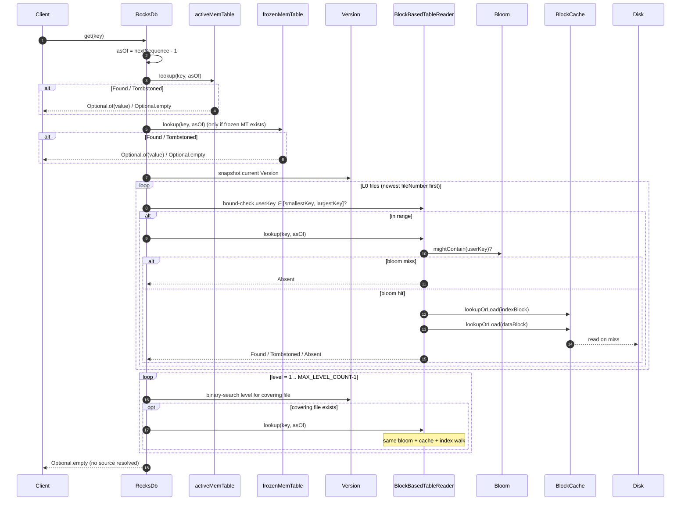
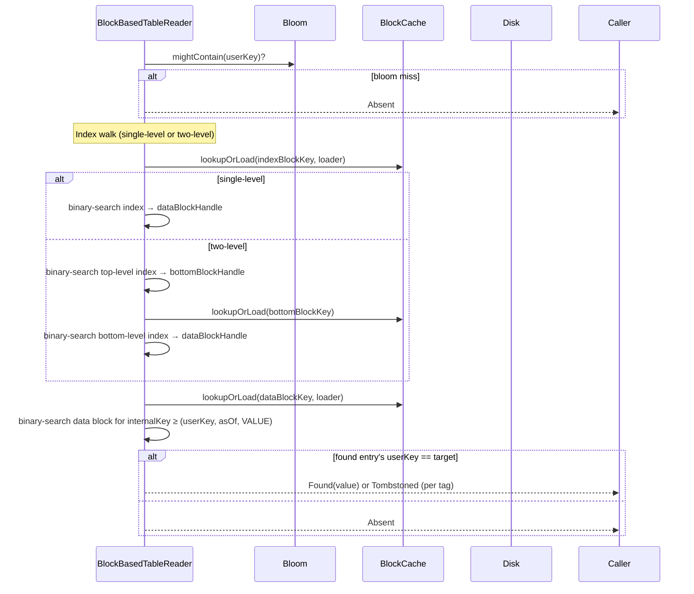

# 04 — Read path

Plan §6.2. The read path resolves "the value of `key` as of `asOf` (a `SequenceNumber`)" by walking a fixed priority order: active MemTable → frozen MemTable → L0 (newest file first) → L1..L_max (binary search). The first `Found` or `Tombstoned` result wins; `Absent` keeps walking.

## API surface

| Method | Returns | Notes |
|---|---|---|
| `RocksDb.get(Key)` | `Optional<Slice>` | `asOf = nextSequence - 1` (read-your-writes within the same engine). |
| `RocksDb.get(Key, Snapshot)` | `Optional<Slice>` | `asOf = snapshot.sequence()`. |
| `RocksDb.getAsOf(Key, UserTimestamp)` | `Optional<Slice>` | UDT path: floor-timestamp lookup via `udtIndex`, then standard `get`. |
| `RocksDb.multiGet(List<Key>)` | `Map<Key, Optional<Slice>>` | Single consistent `asOf` for the whole batch. |
| `RocksDb.multiGet(List<Key>, Snapshot)` | `Map<Key, Optional<Slice>>` | Snapshot-pinned batch. |
| `ColumnFamilyDb.get(ColumnFamilyHandle, Key)` | `Optional<Slice>` | Dispatches to that CF's `RocksDb.get`. |

`scan(Key from, Key to)` throws `UnsupportedOperationException` — forward iteration is not implemented (see [`01-data-model.md`](01-data-model.md) status callout).

## Single-key read



## Priority order — why it works

The internal-key ordering (userKey ASC, **sequence DESC**) means within any one source the *newest* entry for a user key sorts first. Across sources, the rule is:

| Source | Priority | Reason |
|---|---|---|
| Active MemTable | highest — newest writes | Only place writes since last flush land. |
| Frozen MemTable | next — being flushed | Briefly visible during `doFlush`. |
| L0 SSTables (newest fileNumber first) | next | L0 files may overlap; newer flush wins. |
| L1..L_max (binary search for covering file) | lowest | Each level is non-overlapping; at most one candidate file per level. |

If any source returns `Found` or `Tombstoned`, the walk stops — older sources cannot have a newer version. The `Tombstoned` short-circuit is the load-bearing detail: an L0 deletion correctly hides an L5 value.

## Per-SSTable lookup (`BlockBasedTableReader.lookup`)

The read path inside one SSTable file:



Every block read goes through `BlockCache.lookupOrLoad` — both index and data blocks. The loader (executed on cache miss) reads the bytes from disk, verifies the trailing CRC32, and returns the decompressed payload. A CRC mismatch throws `BlockChecksumMismatchException` which the severity classifier maps to `HARD_ERROR_READ_ONLY`.

### Bloom probe

`BloomFilter.mightContain(Key)` — never false negative, ~1% false positive at 10 bits/key (the default `BLOOM_BITS_PER_KEY`). RocksDB's "Kirsch-Mitzenmacher" double-hashing: one 32-bit hash derives `numHashes` bit positions via rotation. The bit array is the file's bloom-filter block payload, loaded once and cached in the `BlockBasedTableReader` instance (not the shared block cache).

### Two-level index

For files above `TWO_LEVEL_INDEX_THRESHOLD` (default 32 MiB), the cost is one extra `Cache.lookupOrLoad` per read. The top-level index is small (a few entries per MiB of bottom-index) and pinned in the reader; the bottom-level index blocks ride the shared block cache and are demand-loaded for the key ranges actually being read.

ADR-0014: the trade is bounded per-file index memory at engine open, in exchange for one extra cache lookup per `get` on those files. Small files (single-level) pay nothing extra.

## Snapshot reads

```java
Snapshot s = db.snapshot();      // captures current sequence
db.put(k, v1);
db.put(k, v2);
Optional<Slice> oldValue = db.get(k, s);   // returns v's predecessor (or absent), not v1/v2
db.releaseSnapshot(s);
```

Snapshots cost a `ConcurrentHashMap.newKeySet()` entry (O(1) acquire/release, no state copy). The `get(key, snapshot)` overload simply passes `snapshot.sequence()` as `asOf` instead of `nextSequence - 1`. Reads at a snapshot are the same code path; only the upper bound differs.

Held snapshots pin compaction: a tombstone with `seq > snapshot.seq` cannot be dropped until the snapshot is released. See [`05-compaction.md`](05-compaction.md) and ADR-0015.

## KV checksum verification (read side)

When the engine was opened with `kvChecksumEnabled = true`, the value bytes from the source layer carry a trailing 4-byte CRC32 (`KvChecksumCodec.unwrap`). `RocksDb.get`:

```java
return readAt(key, asOf).map(v -> unwrapKvChecksumIfNeeded(key, v));
```

`unwrap` verifies the CRC32 over `(userKey || valueWithoutTrailer)` and strips the trailer. A mismatch throws `KvChecksumMismatchException`, which `tripIfHard` classifies as `HARD_ERROR_READ_ONLY` and trips the read-only latch. The exception still propagates to the caller. See [`07-integrity.md`](07-integrity.md).

## MultiGet

ADR-0013, plan §6.2. One batched call resolves N keys against a single consistent `asOf` snapshot, with per-SSTable bucketing dispatched onto `ForkJoinPool.commonPool()`:

```mermaid
sequenceDiagram
    autonumber
    participant Caller
    participant RocksDb
    participant ActMT as activeMemTable
    participant FrzMT as frozenMemTable
    participant Ver as Version
    participant Pool as ForkJoinPool.commonPool
    participant Bucket as bucket task (per SSTable)

    Caller->>RocksDb: multiGet([k1..kN])
    RocksDb->>RocksDb: asOf = nextSequence - 1; dedupe keys
    loop every unique key
        RocksDb->>ActMT: lookup(key, asOf)
        Note over RocksDb: skip if Found / Tombstoned
        RocksDb->>FrzMT: lookup(key, asOf)
    end
    RocksDb->>Ver: snapshot current Version
    Note over RocksDb: bucket = Map<FileNumber, List<keyIndex>>
    loop every unresolved key
        RocksDb->>Ver: find candidate L0 files (range overlap) + per-level binary search
        RocksDb->>RocksDb: add (keyIndex) to each candidate file's bucket
    end
    loop every non-empty bucket
        RocksDb->>Pool: submit(() -> reader.lookup(...) for every bucketed key)
    end
    par parallel bucket tasks
        Pool->>Bucket: open file (cached handle) once; bloom-probe & cache-walk per key
        Bucket-->>RocksDb: Map<keyIndex, KeyLookup>
    end
    RocksDb->>RocksDb: per key, walk candidates in priority order, pick winner
    RocksDb-->>Caller: Map<Key, Optional<Slice>>
```

### Partial-results contract

If any bucket task throws, the **first** observed exception is captured and rethrown after all in-flight tasks settle. The wrapper is `MultiGetPartialResult extends RuntimeException`, which carries:

- `partial()` — `Map<Key, Optional<Slice>>` of results for keys whose buckets all completed cleanly.
- `getCause()` — the underlying exception.

Keys whose bucket tasks failed are absent from the partial map. The thrown exception, if `HARD_ERROR_READ_ONLY`, also trips the read-only latch via `tripIfHard`. ADR-0013 documents this as the v1 contract: partial results plus first error.

### Bucketing details

For each unresolved input key:

- **L0**: sort `version.level(0)` by `fileNumber` descending; collect every file whose `[smallestKey, largestKey]` covers the user key.
- **L1..L_max**: binary search the per-level non-overlapping list for the single covering file (if any).

Each covering file gets the input key's index added to its bucket. The dispatch then submits one task per non-empty bucket; each task opens the file's `BlockBasedTableReader` once (handle is already in `openTables`), runs `lookup` for each bucketed key, and returns the map of resolved `KeyLookup`s.

### Result merge

Per input key, walk its candidate file list in priority order (active MT first, then frozen MT, then L0 newest-first, then L1..L_max). The first `Found` / `Tombstoned` wins. If any bucket the key passed through failed, the key is flagged as `failed[i] = true` and its slot is left as `Optional.empty()` in the returned map — the caller distinguishes via the `MultiGetPartialResult` exception.

## getAsOf — UDT read

```java
db.getAsOf(Key.of("user:42"), new UserTimestamp(12345L));
```

Active only when `userTimestampsEnabled() == true`. The flow:

1. Look up `userKey` in the in-memory `udtIndex` (`ConcurrentHashMap<Key, ConcurrentSkipListSet<Long>>`).
2. Find the **floor** timestamp: largest `ts ≤ asOfTs`. Absent → return empty.
3. Reconstruct the stored key bytes: `userKey || floorTs:8 BE`.
4. Standard `get(Key.of(storedKeyBytes))`.

Visibility is purely user-timestamp ordered; the engine's `SequenceNumber` is incidental.

## Range tombstone consultation

Every source's lookup (`SkipListMemTable.lookup`, `BlockBasedTableReader.lookup`) checks the source's range tombstones for the user key. A range tombstone with `seq ≤ asOf AND seq > anyMatchingPut.seq` suppresses the matching `Found` from that source (the result becomes `Tombstoned`, not `Absent` — older sources are still hidden). The detailed semantics are in ADR-0009.

The read path treats range tombstones the same way as point tombstones at the source level — the only difference is the data structure (interval vs. point) used to detect coverage.

## See also

- ADR-0013 — MultiGet per-SSTable bucketing and ForkJoinPool dispatch.
- ADR-0014 — two-level indices (read-path cost / win).
- ADR-0015 — snapshots as sequence freezes.
- ADR-0007 — user-defined timestamps (read path differs from snapshot reads).
- ADR-0009 — range tombstones during read.
- Source: `rocksdb-engine/.../RocksDb:{get,getAsOf,multiGet,readAt,multiGetAt,resolveBatch,findInLevel}`, `rocksdb-sstable-blockbased/.../BlockBasedTableReader`, `rocksdb-memtable/.../SkipListMemTable:lookup`, `rocksdb-bloom/.../BloomFilter`, `rocksdb-block-cache/.../LruBlockCache`.
- Tests: `rocksdb-engine/.../{MultiGetTest,UserDefinedTimestampsTest,RocksDbReadPathTest,RocksDbBlockCacheTest,DeleteRangeTest}.java`; `rocksdb-sstable-blockbased/.../{BlockBasedTableTest,TwoLevelIndexTest,BloomBlockTest}.java`.
