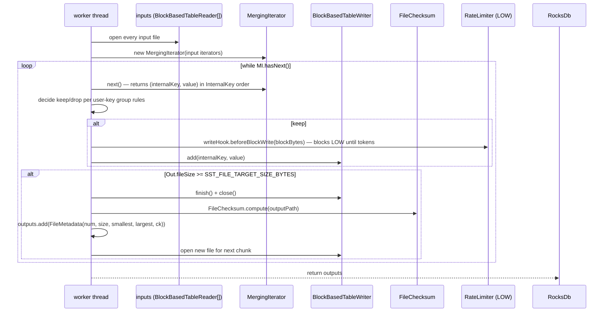

# 05 — Compaction

Plan §6.3. Compaction is the LSM's amortised write — it merges overlapping SSTables into the next level, dropping shadowed values and tombstones along the way. The engine ships four picker styles; each chooses *which* files to compact. One `Compactor` runs the chosen job, applying snapshot-aware tombstone-collection rules and producing one or more output SSTables.

## Compaction styles

| Style | Picker | Module | Trigger | Output |
|---|---|---|---|---|
| `LEVELED` | `LeveledCompactionPicker` | `rocksdb-compaction-leveled` | Score > 1.0 (per-level) | One job at a time merges L_n into L_{n+1}. |
| `DYNAMIC_LEVELED` | `DynamicLeveledCompactionPicker` | `rocksdb-compaction-leveled` | Same scoring; per-level targets recomputed from actual L_max size. | Same as leveled. |
| `TIERED` | `TieredCompactionPicker` | `rocksdb-compaction-tiered` | L0 fan-out / size-ratio thresholds (size-tiered / universal style). | Merges multiple L0 runs into one larger SST. |
| `FIFO` | `FifoCompactionPicker` | `rocksdb-compaction-fifo` | Total L0 bytes > `fifoMaxBytes`. | **Drop** oldest L0 file — no merge. `FifoDeletionJob`. |

> **Implementation status — engine wiring:** `RocksDb.runCompactionPass` and `runParallelL0Compaction` hard-wire `LeveledCompactionPicker`. The `TIERED` and `FIFO` pickers exist as standalone classes with their own tests, and `ColumnFamilyDb` accepts a `CompactionStyle` per CF, but the engine does not dispatch to the corresponding picker today. Calling `compact` on a non-LEVELED CF runs the leveled picker against that CF's level structure. This is the largest current gap between the ADR-0001 promise (per-CF style selection) and the engine code.

## Leveled scoring

Plan §6.3, `LeveledCompactionPicker.scoreFor`:

| Level | Score |
|---|---|
| 0 | `fileCount / L0_FILE_COUNT_TRIGGER` (default trigger = 4 files) |
| n > 0 | `levelSizeBytes(n) / target(n)` where `target(n) = LEVEL_SIZE_BASE_BYTES × LEVEL_SIZE_MULTIPLIER^(n-1)` |

`LEVEL_SIZE_BASE_BYTES = 10 MiB`, `LEVEL_SIZE_MULTIPLIER = 10`, `MAX_LEVEL_COUNT = 7`. Defaults from `Constants.java`.

The picker compacts the **highest-scoring** level whose score is `> 1.0`. Tie-breaks favour lower-numbered levels (L0 first). If no level scores `> 1.0`, the pass returns no work.

### Dynamic Leveled

`DynamicLeveledCompactionPicker` (ADR-0002, CP 15) inverts the level-sizing computation: instead of fixing `target(L1)` and growing upward, it fixes `target(L_max) = actualSize(L_max)` and shrinks downward by the multiplier. Upper levels are always a small fraction of the actual bottom, so the "over-provisioned empty level" pathology that gives plain leveled ~90% worst-case space overhead disappears (~13% for dynamic).

Write amplification is unchanged — the per-key migration rate is the same; only the per-level targets shift.

### Tiered

Size-tiered / universal compaction. The picker merges runs (groups of SSTables) when the count exceeds `level0_file_num_compaction_trigger` or the size ratio between adjacent runs falls below a threshold. Output goes to a higher "level" but the level numbering is a logical run id rather than a strict file-count hierarchy. Best for write-heavy / logging workloads (Table 3 in FAST 2021).

### FIFO

`FifoCompactionPicker` does **no rewriting**. When `level(0).totalSizeBytes > options.fifoMaxBytes`, it identifies the oldest L0 file (lowest `fileNumber`) and emits a `FifoDeletionJob` — the engine drops the file and reclaims the bytes. Cache-of-recent-data workloads (the §2.2 "on-SSD cache" class) tolerate the no-key-retention guarantee.

## Compaction lifecycle

```mermaid
stateDiagram-v2
    [*] --> Idle
    Idle --> Picked: runCompactionPass(maxParallel)\nLeveledPicker.pickMultiple(version, inFlightFiles, maxParallel)
    Picked --> Dispatched: CompactionExecutor.submit per job
    Dispatched --> Running: worker opens inputs, runs N-way merge
    Running --> Written: outputs flushed; FileChecksum computed per output
    Written --> Applied: engine acquires writeLock, applies VersionEdits (DeleteFile* + NewFile*)
    Applied --> Cleaned: close obsolete readers, delete .sst files (or enqueue to FileDeletionScheduler)
    Cleaned --> Idle: inFlightFiles -= job inputs
    Applied --> Failed: I/O error or CRC mismatch
    Failed --> Idle: inFlightFiles cleaned in finally{}; severity classifier maybe trips read-only latch
```

### Picker → job

`LeveledCompactionPicker.pickMultiple(version, inFlightFiles, maxJobs)` returns up to `maxJobs` non-overlapping jobs (no file appears in more than one returned job). A `CompactionJob` is:

```java
record CompactionJob(int inputLevel, int outputLevel,
                     List<FileMetadata> inputs,        // files at inputLevel
                     List<FileMetadata> overlapping);  // files at outputLevel that overlap inputs
```

- For L0: every L0 file not currently in flight is a candidate input. The L1 overlap is computed from the union of input ranges.
- For L > 0: pick the first file in `level(L)` not in `inFlightFiles`. Overlap is the subset of `level(L+1)` whose `[smallest, largest]` user-key range intersects the input's.
- If the chosen file's L+1 overlap intersects `inFlightFiles`, try the next file; return `null` if none free.

The result: every emitted job is **non-overlapping with every in-flight job and with every other emitted job in the same pass**. Workers can run concurrently without coordination.

### Dispatch

`CompactionExecutor` is a fixed-size `ThreadPoolExecutor` sized at `RocksDb.open` time (defaults to 1; CP 10 makes it configurable). The engine submits each picked job as a `Callable<List<FileMetadata>>` returning the new output files.

The **`writeLock` is held only while picking + applying edits**, not while a worker is merging. This is the CP 10 win: foreground writes proceed concurrently with compaction work, and two non-overlapping compactions overlap in time.

### Merge (`Compactor.run`)

Plan §6.3. Opens every input file, builds an N-way merging iterator (`MergingIterator`), and writes outputs:



`SST_FILE_TARGET_SIZE_BYTES` defaults to 2 MiB (`Constants.java`). One job can produce many output files when the merged data exceeds the target.

### Per-user-key keep/drop rules (snapshot-aware tombstone collection)

The `MergingIterator` walks entries in `(userKey ASC, sequence DESC)` order. Within a single user-key group, with `oldestLiveSeq = oldestLiveSnapshotSequence()`:

| Position in group | Bottom level? | Tombstone? | seq vs. oldestLiveSeq | Action |
|---|---|---|---|---|
| First entry in group | yes | yes (DELETION) | `≤ oldestLiveSeq` | **Drop** this and every subsequent entry in the group. Group is fully GC'd. |
| First entry in group | otherwise | — | — | **Keep**. Remember `sawBelowSnapshot` if `seq ≤ oldestLiveSeq`. |
| Subsequent entry in group | — | — | `> oldestLiveSeq` | **Drop** (shadowed by newer entry above snapshots). |
| Subsequent entry in group | — | — | `≤ oldestLiveSeq AND !sawBelowSnapshot` | **Keep** (this is the version snapshot readers will see). Set `sawBelowSnapshot = true`. |
| Subsequent entry in group | — | — | otherwise | **Drop** (we already kept the snapshot-visible entry). |

Bottom-level tombstone-with-no-snapshot pinning it = drop the whole group (the user key has no longer-living version).

This is the minimal correct snapshot-respecting compaction. Per-snapshot precision (one entry per snapshot boundary, when multiple snapshots exist at different sequences) is a future refinement — currently the picker conservatively keeps one entry at-or-below the **oldest** snapshot, which may pin slightly more than strictly required.

### Range-tombstone interaction

Range tombstones in the inputs are forwarded to the output unchanged unless they can be **fully dropped**. A range tombstone is dropped when:

1. The compaction output level is the bottom level, AND
2. Every key the tombstone covers has already been dropped.

Until both conditions hold, the RT travels with its compacted output so subsequent reads still see covered keys as deleted.

## Apply phase

After every worker finishes:

```java
synchronized (writeLock) {
    edits.add(new SetNextFileNumber(allocCounter.get()));
    for (FileMetadata fm : job.inputs())      edits.add(new DeleteFile(job.inputLevel(), fm.fileNumber()));
    for (FileMetadata fm : job.overlapping()) edits.add(new DeleteFile(job.outputLevel(), fm.fileNumber()));
    for (FileMetadata out : outputs)          edits.add(new NewFile(job.outputLevel(), out));
    versions.apply(edits);

    for (FileMetadata out : outputs)
        openTables.computeIfAbsent(out.fileNumber(), ... open reader ...);
    for (FileMetadata fm : job.inputs())      closeAndDelete(fm.fileNumber());
    for (FileMetadata fm : job.overlapping()) closeAndDelete(fm.fileNumber());
}
```

The whole edit batch is one MANIFEST append (one fsync). Readers observe the new `Version` only after `versions.apply` returns. Old SSTable files are deleted synchronously today.

> **Implementation status:** ADR-0005 + CP 16 (`FileDeletionScheduler`) describe rate-limited file deletion via the shared `LOW`-priority bucket to avoid TRIM-storm FTL pressure. The scheduler exists in `rocksdb-rate-limiter` and is tested standalone, but `RocksDb.closeAndDelete` calls `Files.deleteIfExists` directly — the engine does not route deletes through the scheduler today. Wiring it in is a small change confined to that method.

## Parallel L0→L1 compaction

ADR-0009-adjacent (it's a special case of ADR-0001's multi-style coexistence, not its own ADR). `runParallelL0Compaction(targetJobs)` uses `LeveledCompactionPicker.partitionL0`:

```mermaid
flowchart LR
    A[Sort L0 by smallest user key] --> B[Partition into K contiguous groups of ~equal file count]
    B --> C[Compute each group's L1 overlap]
    C --> D{adjacent groups<br/>share any L1 file?}
    D -- yes --> E[Merge the two groups<br/>(L0 files ∪, recompute L1 overlap)]
    E --> C
    D -- no --> F[Emit one CompactionJob per group<br/>each job rewrites disjoint L1 files]
    F --> G[Dispatch concurrently]
```

Merging happens when two sub-ranges would touch the same L1 file — that file can only be rewritten by one worker. The result: `partitionL0(v, 4)` returns ≤ 4 jobs, and the actual count reflects how parallel the data shape allows.

## Snapshot pinning (cost)

ADR-0015. A held snapshot at `seq = S` prevents compaction from:

- Dropping any tombstone with `seq > S` at the bottom level.
- Dropping any superseded value version with `seq > S`.

The space cost shows up at the bottom level: tombstones accumulate until release. `RocksDb.oldestLiveSnapshotSequence` returns `min(activeSnapshotSeqs, lastSequence)` or `Compactor.NO_SNAPSHOTS_HELD = Long.MAX_VALUE`. The engine exposes the active snapshot set so an operator monitoring space-amp can identify the holder.

## Rate-limited compaction I/O

ADR-0005, CP 13. When `RocksDb.open` was called with a non-null `RateLimiter`, every compaction worker installs a `WriteHook` on its output writer:

```java
writeHook.beforeBlockWrite(bodyBytes + 1 + 4)   // body + compType + crc
    → rateLimiter.request(bytes, Priority.LOW)
```

The hook fires per-block in `BlockBasedTableWriter.writeBlock`, so compaction is paced at block granularity. `HIGH`-priority foreground writes (today: WAL flushes if/when wired through the limiter) preempt the LOW caller — see [`09-concurrency-and-resources.md`](09-concurrency-and-resources.md) for the priority discipline.

A shared `RateLimiter` across multiple engines (the `RocksDbHost.openN` pattern) enforces the host-level bytes-per-second budget that ADR-0005 calls for.

## See also

- ADR-0001 — compaction style as runtime config.
- ADR-0002 — Dynamic Leveled as default (target; current default is `LEVELED` — see status callout above and `ColumnFamilyOptions.defaults`).
- ADR-0005 — per-host rate limiter scope.
- ADR-0009 — range tombstones during compaction.
- ADR-0015 — snapshot pinning of tombstones.
- Source: `rocksdb-compaction-leveled/.../{LeveledCompactionPicker,DynamicLeveledCompactionPicker,Compactor,CompactionJob,CompactionExecutor,MergingIterator}`; `rocksdb-compaction-tiered/.../{TieredCompactionPicker,TieredCompactionJob}`; `rocksdb-compaction-fifo/.../{FifoCompactionPicker,FifoDeletionJob}`; `rocksdb-engine/.../RocksDb:{maybeCompact,runCompactionPass,runParallelL0Compaction,applyCompactionResult}`.
- Tests: `rocksdb-compaction-leveled/src/test/java/com/hkg/rocksdb/compaction/*Test.java`; `rocksdb-engine/src/test/java/com/hkg/rocksdb/engine/{MultiThreadedCompactionTest,ParallelL0CompactionTest,RateLimitedCompactionTest}.java`.
