# 08 — Error handling

Plan §5.7. ADR-0008. The engine sorts every thrown exception into one of three severity buckets and acts differently for each. The classifier is the only place severity is assigned; the latch is the only place writes are gated.

## Severity buckets

```java
enum Severity {
    TRANSIENT_RETRYABLE,    // engine retries within budget; surface only after N retries fail
    HARD_ERROR_READ_ONLY,   // engine trips ReadOnlyModeLatch; reads continue, writes fail
    FATAL_HALT              // engine state uninterpretable; embedder must restart
}
```

The hypothesis baked into each bucket:

| Severity | Hypothesis | Engine response |
|---|---|---|
| `TRANSIENT_RETRYABLE` | "This clears itself" — full disk, brief I/O blip, transient lock contention | Retry with backoff; surface only after N retries (today: surface is direct — see status callout below). |
| `HARD_ERROR_READ_ONLY` | "Real damage in one file/block, but the rest of the DB is fine" — disk corruption surface | Trip the read-only latch; subsequent writes throw `ReadOnlyModeException`; reads continue; operator runs `attemptResume()`. |
| `FATAL_HALT` | "State is no longer interpretable" — MANIFEST CRC mismatch, footer magic mismatch | Engine refuses to remain open; operator triages with `db-verify` / manual MANIFEST surgery. |

> **Implementation status — retry policy:** ADR-0008 calls for the engine to **retry** `TRANSIENT_RETRYABLE` errors within a backoff budget before surfacing them. The current `SeverityClassifier` correctly classifies these errors, but no retry loop exists — every exception propagates immediately to the caller. The classification still matters because `TRANSIENT_RETRYABLE` does NOT trip the read-only latch (so a brief `ENOSPC` doesn't take the engine offline for reads + writes).

## SeverityClassifier

`SeverityClassifier.classify(Throwable)` walks an ordered set of rules:

| # | Rule | Severity | Notes |
|---|---|---|---|
| 0 | Caller-supplied override map (`Map<String substring, Severity>`) | per map | First substring whose target class name appears in the throwable's class hierarchy wins. Optional; used by tests and by engine modules adding custom-exception classifications without taking a build-time dependency on this module. |
| 1 | `IOException` with "ENOSPC-like" message (`no space left`, `enospc`, `disk full`, `disk quota exceeded`, case-insensitive) | `TRANSIENT_RETRYABLE` | |
| 2 | Class-name (any superclass) contains `BlockChecksumMismatchException` | `HARD_ERROR_READ_ONLY` | String-matched to avoid a build-time dependency on `rocksdb-sstable-blockbased`. |
| 3 | Class-name contains `SsTableFormatException` AND message contains `footer` | `FATAL_HALT` | Footer is the structural anchor; if it fails to parse, recovery cannot proceed. |
| 4 | Any other `IOException` | `TRANSIENT_RETRYABLE` | Default for I/O. |
| 5 | Anything else | `FATAL_HALT` | "Panic" fall-through — unanticipated `RuntimeException` is by hypothesis a bug; halt rather than scribble on disk state under a broken assumption. |

The classifier is **stateless and reentrant**; a single instance is safely shared across all threads.

### Why string-matching for class names

The classifier module (`rocksdb-error-handling`) intentionally does not depend on `rocksdb-sstable-blockbased` or `rocksdb-manifest`. Importing those modules just to write `instanceof BlockChecksumMismatchException` would invert the dependency graph. String matching by class name keeps the classifier free of build-time edges, matching the §5.7 plan note.

The cost: a renamed exception class silently breaks classification. The test suite (`SeverityClassifierTest`) pins the class names; renaming requires updating both the exception and the classifier.

## ReadOnlyModeLatch

A one-way latch with three operations:

```java
final class ReadOnlyModeLatch {
    void trip(String reason);     // idempotent; latest reason wins
    boolean isTripped();          // volatile read; lock-free
    String reason();              // null when not tripped
    void ensureWritable();        // throws ReadOnlyModeException if tripped
    void attemptResume();         // operator-driven clear
}
```

### Flow

```mermaid
stateDiagram-v2
    [*] --> Writable
    Writable --> Tripped: trip(reason)
    Tripped --> Tripped: trip(otherReason) — overwrites reason; idempotent
    Tripped --> Writable: attemptResume() — operator-driven
    Writable --> Writable: ensureWritable() returns
    Tripped --> [*]: ensureWritable() throws ReadOnlyModeException
```



### Concurrency

- `tripped` flag is `volatile` so `isTripped()` and `ensureWritable()` are lock-free fast paths.
- `trip()` / `attemptResume()` synchronise on the instance to keep the `tripped`/`reason` pair coherent.
- The latch is per-`RocksDb` instance, not per-CF. A KV checksum mismatch in CF `users` trips the latch for the entire DB (every CF's writes fail). Operators wanting tighter blast radius need separate DBs — ADR-0008 documents this trade.

### Why `attemptResume`, not auto-resume

ADR-0008 rejects auto-clearing the latch on a timer: a HARD error is by hypothesis a real problem, and silent clearance defeats the §5 investigative intent. `attemptResume()` is named to flag that it does NOT verify the underlying condition has cleared — only that the operator has chosen to retry. If the corrupt block is still cached, the next failing read will re-trip the latch.

## Engine integration

Every write entry point starts with `readOnlyLatch.ensureWritable()`:

```java
public void put(Key key, Slice value) {
    readOnlyLatch.ensureWritable();      // throws if tripped — no seq consumed, no WAL append
    synchronized (writeLock) { ... }
}
```

Reads do NOT consult the latch — they remain available throughout the read-only state.

Every catch block in the write path and the read path calls `tripIfHard(throwable)`:

```java
private Severity tripIfHard(Throwable t) {
    Severity sev = severityClassifier.classify(t);
    if (sev == Severity.HARD_ERROR_READ_ONLY) {
        readOnlyLatch.trip(t.getClass().getSimpleName() + ": " + t.getMessage());
    }
    return sev;
}
```

The exception still propagates; the latch ensures subsequent writes are gated even if the caller catches and continues.

## Failure-modes catalog

| Trigger | Surfaced as | Severity | Engine response | Operator action |
|---|---|---|---|---|
| WAL fragment CRC mismatch mid-file | `WalCorruptionException` thrown by `LogReader.readRecord` | (treated as recovery-time error during `RocksDb.open`) | Open fails; engine never starts. | `db-verify --wal-only` (future); inspect with `LogReader` directly; truncate at known good record. |
| WAL torn write at tail-of-file | `LogReader.readRecord` returns `Optional.empty()` silently | (not an error) | Lost write(s) since last fsync. Replay continues with what's intact. | None — this is the documented crash recovery behaviour. |
| MANIFEST record CRC mismatch | `ManifestCorruptionException` from `Manifest.replay` | `FATAL_HALT` (classifier rule 5: unanticipated `RuntimeException`-equivalent) | `VersionSet.open` throws; engine cannot start. | Manual triage with `manifest-dump`; potentially `CURRENT` rewrite to a prior MANIFEST snapshot. |
| Unknown MANIFEST edit tag | `IllegalArgumentException` from `VersionEditCodec.decode` → wrapped as `ManifestCorruptionException` | `FATAL_HALT` | Same as above. | Same — the engine has no skip-unknown story today (see [`02-on-disk-formats.md`](02-on-disk-formats.md) status callout). |
| `CURRENT` missing or malformed | `ManifestCorruptionException` | `FATAL_HALT` | Open fails. | Restore `CURRENT` from backup or list MANIFEST files and pick the latest. |
| SSTable footer magic mismatch | `SsTableFormatException("footer magic mismatch: ...")` | `FATAL_HALT` (classifier rule 3) | Reader open throws; the engine refuses to remain functional. | Replace file from backup, or remove it and rebuild via `dropColumnFamily` + reimport. |
| SSTable block CRC mismatch | `BlockChecksumMismatchException` | `HARD_ERROR_READ_ONLY` | Latch tripped; reads continue (the bad block can still be re-read repeatedly, will continue to throw); writes fail with `ReadOnlyModeException`. | `db-verify` to identify affected files; restore from backup; `attemptResume`. |
| KV checksum mismatch | `KvChecksumMismatchException` (only when `kvChecksumEnabled`) | `HARD_ERROR_READ_ONLY` | Latch tripped on next `get` that exposes the bad value. | Same — `db-verify`, file restore, `attemptResume`. |
| `ENOSPC` during WAL append or SSTable write | `IOException("No space left on device")` | `TRANSIENT_RETRYABLE` | Currently surfaces directly to caller (no retry loop — status callout above). Latch is NOT tripped. | Free disk space; retry the write. |
| Generic `EIO` during read | `IOException` | `TRANSIENT_RETRYABLE` (rule 4) | Surfaced to caller. | Investigate underlying disk; retry. |
| `multiGet` partial bucket failure | `RocksDb.MultiGetPartialResult extends RuntimeException` | Wrapped cause is classified; if HARD, latch trips. | Partial result map exposed via `partial()`; first error in `getCause()`. | Inspect cause; restore / retry as appropriate. |
| Snapshot held too long | (not an exception) | — | Compaction's `oldestLiveSnapshotSequence` pins tombstones at the bottom level. Space-amp grows. | Operator inspects `db.snapshots()` (or per ADR-0015 docs) and releases the holder. |
| `deleteRange(start, end)` with `start ≥ end` | `IllegalArgumentException` from `RangeTombstone` constructor | `FATAL_HALT` (rule 5 fall-through) | Throws to caller. | Fix the caller. |
| `put` after `close` | `IllegalStateException` from `walWriter.append` on a closed channel | `FATAL_HALT` (rule 5) | Throws. | Don't `put` after `close`. |
| `LogWriter.Buffered` background fsync fails | `IOException` captured in `BackgroundFlusher.lastError`; re-raised on `close()` | `TRANSIENT_RETRYABLE` (rule 4) | Surface at close time. | Investigate disk; close + reopen will replay from WAL. |

## Per-CF blast radius

The latch is per-`RocksDb` instance. Under `ColumnFamilyDb` (where each CF is its own `RocksDb`), a HARD error in one CF only trips that CF's latch — other CFs continue to accept writes. This is a side effect of the current per-CF-subdirectory layout (see [`06-column-families.md`](06-column-families.md)).

Under the target shared-WAL+MANIFEST layout, a MANIFEST CRC mismatch would be `FATAL_HALT` for every CF. The per-CF isolation today is accidental, not designed.

## Recovery (`attemptResume`)

The operator's contract for clearing the latch:

1. Call `db.readOnlyReason()` to see the last-known cause.
2. Investigate: `db-verify` for integrity issues; OS-level disk checks for IO errors.
3. Restore / repair the underlying problem (replace file from backup, free disk, etc.).
4. Call `db.attemptResume()`.
5. Optionally retry the failed write. If the underlying issue persists, the latch trips again on the next failing operation.

There is no time-bounded retry; the contract is fully operator-driven. The CLI / runtime admin port surfaces `attemptResume` as a deliberate, explicit action.

## See also

- ADR-0008 — severity-based error handling (the load-bearing design choices).
- ADR-0003 — what each integrity layer's failure looks like in this catalog.
- ADR-0010 — the missing skip-unknown story (why "unknown MANIFEST tag" is FATAL today).
- Source: `rocksdb-error-handling/.../{Severity,SeverityClassifier,ReadOnlyModeLatch,ReadOnlyModeException}`; `rocksdb-engine/.../RocksDb:{tripIfHard,isReadOnly,readOnlyReason,attemptResume}`; `rocksdb-manifest/.../ManifestCorruptionException`; `rocksdb-wal/.../WalCorruptionException`; `rocksdb-sstable-blockbased/.../{BlockChecksumMismatchException,SsTableFormatException}`; `rocksdb-integrity/.../{KvChecksumMismatchException,FileChecksumMismatchException}`.
- Tests: `rocksdb-error-handling/src/test/java/com/hkg/rocksdb/errorhandling/{SeverityClassifierTest,ReadOnlyModeLatchTest}.java`; `rocksdb-engine/src/test/java/com/hkg/rocksdb/engine/SeverityIntegrationTest.java`; `rocksdb-wal/.../{CrcCorruptionTest,TornWriteTest}.java`.
