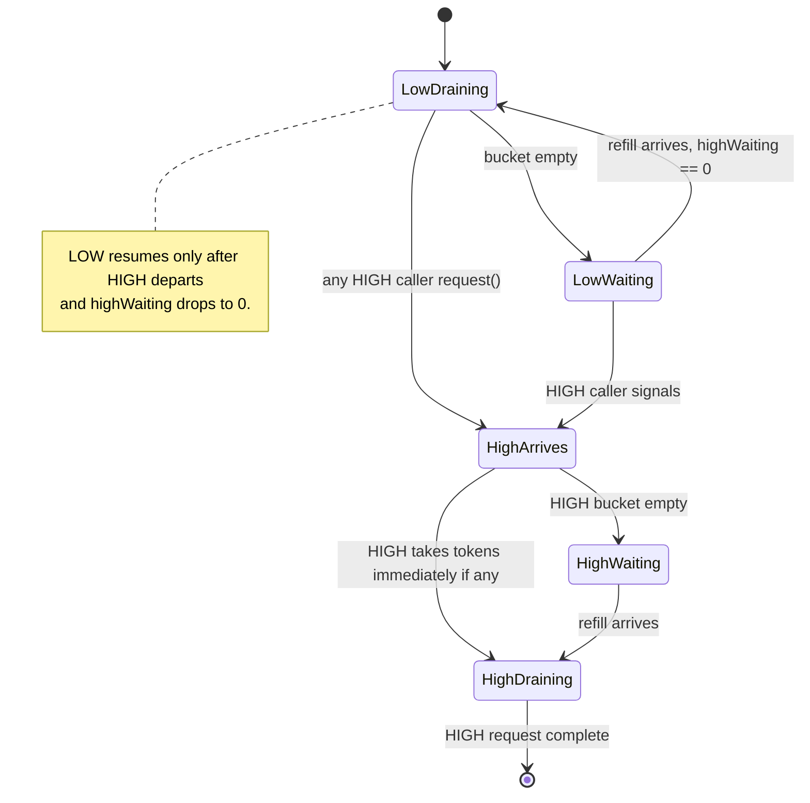

# 09 — Concurrency and resources

Plan §5.6, §6.1. ADR-0005. This section catalogues every lock, thread pool, and shared resource the engine uses, plus the priority discipline that keeps foreground writes from waiting behind compaction.

## Lock catalogue

| Lock | Owner | Scope | Purpose |
|---|---|---|---|
| `Object writeLock` | `RocksDb` (one per instance) | Holds for the duration of every write call AND the apply phase of every compaction. | Serialise mutations, sequence allocation, WAL append, MemTable insert, MANIFEST edit apply. |
| `synchronized` on `Manifest`, `VersionSet` | `Manifest` / `VersionSet` (one per instance) | Single MANIFEST writer at a time. | The engine's `writeLock` already serialises calls; this is belt-and-braces. |
| `synchronized` on `LruBlockCache` | block cache | Per cache operation (lookup, insert, eviction). | Single-shard LRU; ADR notes that production RocksDB shards the lock — accepted simplification. |
| `ReentrantLock` in `TokenBucketRateLimiter` | rate limiter | Per `request()` call. | Guards `tokensAvailable`, `lastRefillNanos`, `highWaiting`. |
| `ReentrantLock` in `FileDeletionScheduler` | scheduler | Per queue mutation / drain. | Guards the deletion queue and pending-bytes counter. |

`SkipListMemTable` is **lock-free** for reads and **internally synchronised** for writes via `ConcurrentSkipListMap`. The engine's `writeLock` reduces concurrent writers to one anyway.

## Lock-free read paths

Reads do not take `writeLock`:

```java
SkipListMemTable active = activeMemTable;   // volatile read
SkipListMemTable frozen = frozenMemTable;   // volatile read (may be null)
Version v = versions.current();             // volatile read; Version is immutable
```

- `activeMemTable` / `frozenMemTable` are `volatile` references. The reader gets a coherent pointer to either the pre-flush or post-flush MemTable depending on its arrival.
- `Version` is immutable. `levels()` returns an unmodifiable list of unmodifiable lists. `versions.current()` returns the snapshot the reader uses for its entire walk; concurrent compactions producing a new `Version` do not affect in-flight reads.
- `openTables` is a `ConcurrentHashMap<FileNumber, BlockBasedTableReader>`. A reader that misses (compaction closed the file after `Version` snapshot) treats it as `Absent`.

Sequence allocation uses `AtomicLong nextSequence`; the engine reads `nextSequence.get()` lock-free to compute `asOf` for reads and snapshots.

## Thread pools and daemons

| Pool | Class | Sized | Lifecycle |
|---|---|---|---|
| Compaction workers | `CompactionExecutor` (`FixedThreadPool`) | Fixed at `RocksDb.open` (default 1) | Created per engine; shut down in `close()`. |
| MultiGet bucket dispatch | `ForkJoinPool.commonPool()` (JVM-shared) | JVM-default (= available cores) | Shared with the rest of the application. |
| WAL background flusher | `BackgroundFlusher` daemon thread (only when `WalDurability.Buffered`) | One per `LogWriter` | Spawned in `LogWriter` ctor; joined in `close()`. |
| File-deletion worker | `FileDeletionScheduler` daemon thread | One per scheduler | Spawned on `start()`; joined on `close()` (30 s drain timeout). |

All daemons set `setDaemon(true)` so they never block JVM shutdown.

> **Implementation status:** `FileDeletionScheduler` is implemented and tested but **not wired into the engine** — `RocksDb.closeAndDelete` calls `Files.deleteIfExists` directly. Routing it through the scheduler (ADR-0005 + CP 16 target) is a small change confined to that method.

## In-flight compaction coordination

`Set<FileNumber> inFlightFiles` (a `ConcurrentHashMap.newKeySet()`) tracks which SSTables are currently being read by a compaction worker. The picker consults it:

```java
List<CompactionJob> jobs = picker.pickMultiple(version, inFlightFiles, maxParallel);
// emitted jobs are non-overlapping with inFlightFiles and with each other
```

The engine adds every input file to `inFlightFiles` *before* dispatching to the executor and removes them in a `finally` block after the apply phase. This guarantees that:

- Two non-overlapping compactions can run concurrently.
- A compaction in progress is invisible to the next picker pass (no double-pick).
- Failure cleanup is guaranteed (`finally` removes even on apply-phase exceptions).

## Block cache (`LruBlockCache`)

`rocksdb-block-cache`. Single-shard LRU keyed by `(dbDir, fileNumber, blockHandle)`. Capacity is a byte budget (default `BLOCK_CACHE_DEFAULT_BYTES = 8 MiB`); eviction runs after every `insert` until `currentBytes ≤ capacityBytes`.

```java
public interface BlockCache {
    Optional<byte[]> lookup(CacheKey key);
    void insert(CacheKey key, byte[] payload);
    byte[] lookupOrLoad(CacheKey key, Loader loader) throws IOException;   // miss-loads outside the lock
    long usageBytes();
    long capacityBytes();
}
```

`lookupOrLoad` is the hot-path API. On a cache miss, the loader runs **outside the cache's lock** so two concurrent misses on different keys don't serialise on disk I/O. The loader returns the decompressed block payload; the cache's `insert` race-resolves (if a peer inserted under the same key while the loader was running, the peer's payload wins).

### Sharing across instances

`RocksDbHost.openN(count, baseDir, sharedLimiter, sharedBlockCache)` opens N `RocksDb` instances against one block cache. The cache key includes the DB directory string so per-instance file numbers (which restart from 1 per fresh DB) don't collide.

### Single-shard contention

ADR notes that production RocksDB shards the cache lock to reduce contention; this engine accepts a single lock as a pedagogical simplification. At target scales (8 MiB cache, one process), contention is acceptable.

## Rate limiter (`TokenBucketRateLimiter`)

`rocksdb-rate-limiter`. Process-wide bytes-per-second budget shared across compaction workers (and, in the target, foreground WAL flushes).

```java
public interface RateLimiter {
    void request(long bytes, Priority priority) throws InterruptedException;
}

enum Priority { HIGH, LOW }
```

### Token bucket

- Capacity: `burstBytes = bytesPerSecond × refillIntervalMillis / 1000` (clamped to ≥ 1).
- Refill: continuous, computed against `System.nanoTime()` (wall-clock changes don't perturb the schedule).
- Initial state: full bucket (a cold start doesn't block the first request).

### Priority discipline (ADR-0005)

`HIGH` callers preempt `LOW`:

- A `LOW` caller is allowed to drain tokens only while `highWaiting == 0`.
- A `HIGH` arrival increments `highWaiting` and `signalAll`s, causing in-progress `LOW` callers to stop draining on the next pass and yield.
- A `HIGH` caller departing (token grant complete) decrements `highWaiting` and `signalAll`s so blocked `LOW` callers can re-evaluate.

Foreground writes never wait behind compaction *once they enter the limiter*. A lightly-loaded host still lets compaction consume the full budget.



### Where it fires

- **Compaction output** (`Priority.LOW`): every block write in `BlockBasedTableWriter.writeBlock` calls `writeHook.beforeBlockWrite(bodyBytes + 1 + 4)`, which dispatches to `rateLimiter.request(bytes, LOW)`. The hook is installed by `RocksDb.rateLimiterHookFor(LOW)` when the engine was opened with a non-null limiter.
- **File deletion** (`Priority.LOW`): `FileDeletionScheduler` charges each file's logical size against the same limiter before invoking `Files.deleteIfExists`. This prevents the TRIM-storm FTL pressure that ADR-0005 calls out.

> **Implementation status:** ADR-0005 / CP 13 target also has foreground WAL flushes go through the limiter at `Priority.HIGH`. Today the WAL writer fsyncs directly without consulting the limiter — there is no `HIGH` caller in the current engine, so the priority preemption code path is untested in production paths (it has unit tests in the limiter module).

## Memory budget

Where the engine holds bytes:

| Source | Default | Where it lives |
|---|---|---|
| Active MemTable | up to `MEMTABLE_FLUSH_THRESHOLD_BYTES = 4 MiB` | on-heap `ConcurrentSkipListMap` + `byte[]` values + RT list |
| Frozen MemTable | up to 4 MiB (briefly, during flush) | same |
| Block cache | `BLOCK_CACHE_DEFAULT_BYTES = 8 MiB` (configurable) | on-heap `LinkedHashMap<CacheKey, byte[]>` |
| Per-`BlockBasedTableReader` bloom filter | ~10 bits/key per SSTable | pinned in the reader |
| Per-`BlockBasedTableReader` top-level index (two-level files) | tens of KB per file | pinned in the reader |
| Per-`BlockBasedTableReader` single-level index (small files) | tens of KB to ~1 MiB per file | pinned in the reader |
| UDT index | O(unique-keys × unique-timestamps) | `ConcurrentHashMap<Key, ConcurrentSkipListSet<Long>>` rebuilt on open |
| `openTables` map | one `BlockBasedTableReader` per live SSTable | `ConcurrentHashMap` |
| `activeSnapshotSeqs` | one `Long` per held snapshot | `ConcurrentHashMap.newKeySet` |
| Rate limiter / scheduler queues | small | per-instance |

ADR-0014 (two-level indices) bounds the per-`Reader` memory for large files: only the small top-level index is pinned; bottom-level index blocks ride the shared block cache and are evicted under pressure.

ADR-0007's status callout: UDT index memory is O(unique-keys × unique-timestamps) and not budgeted. A persistent per-CF sidecar would replace the in-memory index in a production deployment.

## RocksDbHost — multi-instance composition

`rocksdb-test-cluster/.../RocksDbHost`. Opens N `RocksDb` instances against shared resources for integration tests:

```java
try (RocksDbHost host = RocksDbHost.openN(
        4,                                    // count
        baseDir,                              // each instance gets baseDir/inst-i/
        sharedRateLimiter,                    // one limiter across all instances
        sharedBlockCache)) {                  // one cache across all instances
    host.instance(0).put(...);
    host.instance(1).put(...);
}
```

ADR-0005's per-host shared-budget contract realised in JVM. Each instance is opened with `compactionThreads=1` so per-instance request counts are deterministic for testing; production code would wire a per-host `CompactionExecutor` instead of a per-instance one (target, not implemented).

## Thread-safety summary table

| Operation | Concurrent with itself? | Concurrent with other ops? | Notes |
|---|---|---|---|
| `RocksDb.put` / `delete` / `deleteRange` | Serialised by `writeLock` | Yes with reads, snapshots, compaction merging | Compaction apply also takes `writeLock`. |
| `RocksDb.get` | Fully concurrent | Yes with everything | Reads MemTable / frozen MT / Version lock-free. |
| `RocksDb.multiGet` | Fully concurrent | Yes with everything | Buckets dispatched to `ForkJoinPool.commonPool()`. |
| `RocksDb.snapshot()` / `releaseSnapshot` | Concurrent | Yes | `ConcurrentHashMap.newKeySet` mutations. |
| `RocksDb.flush()` | Serialised by `writeLock` | Reads continue (against active MT, frozen MT during flush) | |
| `RocksDb.runCompactionPass` | Serialised picking + applying (writeLock); workers run concurrently | Reads continue | Apply phase contends with writes for `writeLock`. |
| `RocksDb.close()` | Not concurrent with anything | — | Caller must quiesce. |

## See also

- ADR-0005 — per-host rate limiter scope.
- ADR-0006 — column families (block cache + limiter are intentionally cross-CF).
- ADR-0008 — `ReadOnlyModeLatch` interacts with the lock model (writes gate on the latch, reads do not).
- ADR-0013 — MultiGet's use of `ForkJoinPool.commonPool()`.
- ADR-0014 — two-level indices bound per-reader memory.
- Source: `rocksdb-engine/.../RocksDb` (lock fields and entry points); `rocksdb-rate-limiter/.../{TokenBucketRateLimiter,RateLimiter,Priority,FileDeletionScheduler}`; `rocksdb-block-cache/.../{LruBlockCache,BlockCache,CacheKey}`; `rocksdb-compaction-leveled/.../CompactionExecutor`; `rocksdb-test-cluster/.../RocksDbHost`.
- Tests: `rocksdb-rate-limiter/src/test/java/com/hkg/rocksdb/ratelimiter/{TokenBucketRateLimiterTest,FileDeletionSchedulerTest}.java`; `rocksdb-block-cache/.../LruBlockCacheTest.java`; `rocksdb-engine/.../{MultiThreadedCompactionTest,RateLimitedCompactionTest}.java`; `rocksdb-test-cluster/.../{SharedRateLimiterTest,SharedCacheTest}.java`.
